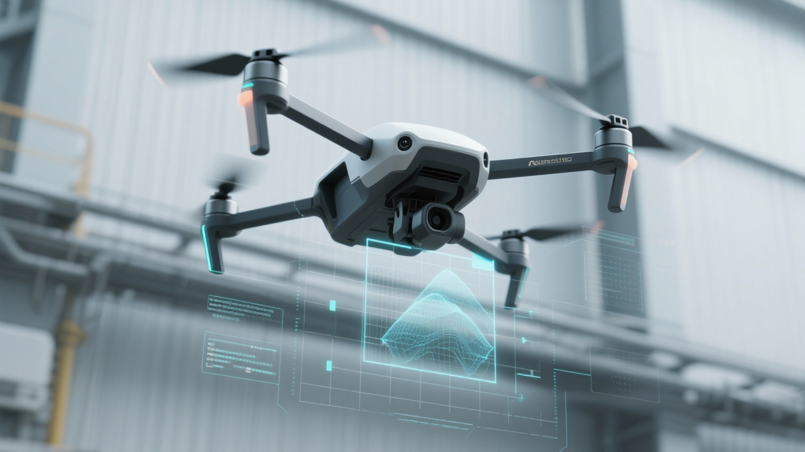

<div align="center">

# 🚁 Proyecto de Dron Autónomo: AirSim + YOLO11


**Sistema integral de simulación, navegación autónoma y visión por computador.**

[Ver Documentación](./docs/) • [Reportar Bug](https://github.com/Meferal/tu-repo/issues) • [Solicitar Feature](https://github.com/Meferal/tu-repo/issues)

</div>

---

## 📖 Descripción

Este proyecto integra un pipeline completo de **simulación, captura de datos, control autónomo e inferencia**, utilizando **Microsoft AirSim** como entorno de pruebas y **Ultralytics YOLO11** para la visión por computador.

El objetivo es desarrollar un dron capaz de:
1.  **Volar de forma autónoma** manteniendo su trayectoria.
2.  **Evitar colisiones** mediante sensores de profundidad.
3.  **Detectar elementos** del entorno (vehículos, peatones, obstáculos) en tiempo real utilizando modelos entrenados con una fusión de datos sintéticos y reales.

---

## 🎯 1. Objetivos del Proyecto

* **Simulación de Alto Realismo:** Control del dron mediante API de AirSim, captura de imágenes RGB/Depth y generación de trayectorias automáticas.
* **Arquitectura Modular:** Separación de entornos de ejecución para garantizar estabilidad: uno dedicado a la física (AirSim) y otro a la IA (YOLO).
* **Ingeniería de Datos:** Creación de un *Unified Dataset* fusionando fuentes de Roboflow (simulados) y Ultralytics (reales) para maximizar la generalización del modelo.
* **YOLO11 Custom Training:** Entrenamiento de un modelo de última generación para la detección de obstáculos y navegación.
* **Inferencia en Loop:** Evaluación del modelo sobre el stream de vídeo del simulador para la toma de decisiones.

---

## 🗂️ 2. Estructura del Proyecto

```text
📦 Proyecto_ML_dron
├── 📂 airsim/                # Binarios y configuraciones de AirSim (settings.json)
├── 📂 datasets/              # Datos crudos y procesados
│   └── 📂 dataset_unificado  # Dataset final para entrenamiento
├── 📂 docs/                  # Documentación y recursos gráficos
│   ├── 📂 img
│   └── 📂 Presentacion_tecnica
├── 📂 models/                # Pesos (.pt) de los modelos YOLO11 entrenados
├── 📂 src/                   # Código fuente principal
│   ├── 📂 AirSim_env         # Scripts de control de vuelo y recolección de datos
│   ├── 📂 YOLO_env           # Scripts de entrenamiento e inferencia
│   ├── 📂 obs                # Versiones anteriores de los scripts
│   ├── 📂 pruebas            # Scripts de testeo unitario
│   ├── 📂 Entrenamiento_YOLO # Scripts de entrenamiento YOLO en Google Colab
│   └── 📂 utils              # Herramientas auxiliares
├── 📂 venv/                  # Archivos de configuración de entornos Conda
│   ├── environment_airsim.yml
│   └── environment_drone_yolo.yml
├── LICENSE
└── README.md
```

## 📦 3. Instalación y Requisitos

Este proyecto está optimizado para Windows y utiliza Python 3.11.9. Para evitar conflictos de dependencias, se emplean dos entornos Conda independientes.

Prerrequisitos
Anaconda o Miniconda.

Binarios de AirSim (Recomendado: Neighborhood o Blocks).

Drivers CUDA actualizados (para entrenamiento YOLO).

Configuración de Entornos
Los archivos de configuración se encuentran en la carpeta venv/.

🔹 Entorno 1: Simulación (airsim_env)
Encargado de la conexión RPC con el simulador y el control de vuelo.

``` bash  
conda env create -f venv/environment_airsim.yml
conda activate airsim_env
```

🔹 Entorno 2: Visión (drone_yolo)
Encargado del entrenamiento e inferencia con YOLO11.

``` bash
conda env create -f venv/environment_drone_yolo.yml
conda activate drone_yolo
```

---

Para ejecutar el programa es necesario:  
1. Abrir el entorno Airsim  
2. Ejecutar el archivo yolo_detector.py ubicado en src/YOLO_env en entorno YOLO  
3. Ejecutar el archivo dron_autonomo.py ubicado en src/AirSim_env en entorno AirSim  

---

## 📊 4. Datos y Entrenamiento

Se ha generado un dataset híbrido para robustecer el modelo ante el domain gap (diferencia entre simulación y realidad).

🔹 Roboflow Universe (Simulados / AirSim)  

| Proyecto Roboflow      | Workspace (Autor)       | Versión |  Licencia | Enlace                                                                                                                                                                           |
| :--------------------- | :---------------------- | :-----: | :-------: | :------------------------------------------------------------------------------------------------------------------------------------------------------------------------------- |
| **AirSim**             | *uczelnia*              |    v3   | CC BY 4.0 | [https://universe.roboflow.com/uczelnia/airsim-z2xqd/dataset/3](https://universe.roboflow.com/uczelnia/airsim-z2xqd/dataset/3)                                                   |
| **Car Detection YOLO** | *airsim-car-yolo-model* |    v3   | CC BY 4.0 | [https://universe.roboflow.com/airsim-car-yolo-model/car-detection-yolo-jw0hn/dataset/3](https://universe.roboflow.com/airsim-car-yolo-model/car-detection-yolo-jw0hn/dataset/3) |
| **Drone Final Year**   | *harshsomaiya*          |    v1   | CC BY 4.0 | [https://universe.roboflow.com/harshsomaiya/dronefinalyear/dataset/1](https://universe.roboflow.com/harshsomaiya/dronefinalyear/dataset/1)                                       |
| **My First Project**   | *airsim-yolo*           |    v2   | CC BY 4.0 | [https://universe.roboflow.com/airsim-yolo/my-first-project-gmeis/dataset/2](https://universe.roboflow.com/airsim-yolo/my-first-project-gmeis/dataset/2)                         |

🔹 Ultralytics (Reales)  

| Dataset      | Tipo de Datos          | Descripción                                               | Enlace / Fuente                                                                              |
| :----------- | :--------------------- | :-------------------------------------------------------- | :------------------------------------------------------------------------------------------- |
| **VisDrone** | Dron – Mundo real      | Escenas urbanas reales, tráfico y peatones                | [https://github.com/VisDrone/VisDrone-Dataset](https://github.com/VisDrone/VisDrone-Dataset) |
| **KITTI**    | Vehículos – Mundo real | Escenas urbanas y tráfico con anotaciones de alta calidad | [https://www.cvlibs.net/datasets/kitti/](https://www.cvlibs.net/datasets/kitti/)             |

Descarga de todos los datasets en formato YOLO (YOLOv11).

Pipeline de Procesamiento
Homologación: Mapeo de clases a taxonomía común (ej. vehicle, automobile → car).

Limpieza: Eliminación de anotaciones corruptas y normalización de coordenadas.

Unificación: Fusión en estructura YOLO estándar:

```text
datasets/
  ├── 📂 dataset_unificado/
  │   ├── 📂 test/
  │   │     ├── images/
  │   │     └── labels/
  │   ├── 📂 train/
  │   │     ├── images/
  │   │     └── labels/
  │   └── 📂 valid/
  │         ├── images/
  │         └── labels/
  │
  └── merged.yaml  

Actualización del merged.yaml con clases finales y rutas.
```

| Funcionalidad | Estado | Descripción |
| :--- | :---: | :--- |
| **Control de Vuelo** | ✅ | Despegue, aterrizaje y navegación por waypoints. |
| **Sensores** | ✅ | Captura sincronizada de RGB y Depth. |
| **Orientación** | ✅ | Rotación automática hacia el vector de velocidad. |
| **Visión (YOLO11)** | ✅ | Entrenamiento completado y validado. |
| **Inferencia** | ✅ | Detección en tiempo real sobre ventana de AirSim. |
| **Evitación de Obstáculos** | ✅ | Lógica reactiva basada en Depth. |
| **Sim-to-Real** | 🔜 | Pruebas planificadas en hardware físico. |

## 🧑‍💻 Autores

Proyecto realizado por:

-**Álvaro Medina Fernández [LinkedIn](http://www.linkedin.com/in/álvaro-medinafernández) | [GitHub](https://github.com/Meferal)**  

Bajo la supervisión de **Borja Barber [GitHub](https://github.com/borjabarber)** , *Lead Instructor en The Bridge*.

---

📜 Licencia
Este proyecto se distribuye bajo la licencia MIT. Consulta el archivo LICENSE para más detalles.
